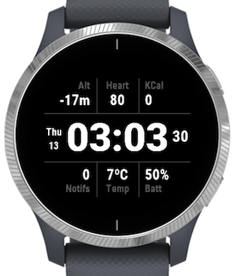

# A.S. Garmin Watch Face

My personal Watch Face for Garmin watches inspired by some Watch Faces that can be found on Connect IQ store. 
Tested only with Garmin vívoactive 4. I have no plans to support other devices so feel free to fork it and modify it for your own private use case.

You need to use Eclipse to develop Watch Face: Garmin has no support for IntelliJ IDEA unfortunately.

### How to install Watch Face
1. In Eclipse go to: Connect IQ -> Build for Device Wizard: you will export a .prg file
2. Copy .prg file to /GARMIN/APPS/ on your device via usb

Note: On Mac you need `Android File Transfer` to copy files to device. Also if you have Garmin Express on Mac 
you should close it while using `Android File Transfer`. To do so you have to go to:

Garmin Express -> Preferences -> General:
1. uncheck: Always keep Garmin Express running in the background
2. uncheck: Automatically launch Garmin Express when a Garmin device is connected

Then close it.

### Known issues
Units are not translated regarding the System settings, since I am happy with meters and Celsius that are default. 
But this is easy fix if you want to handle it.

### Resources
1. Garmin Api: https://developer.garmin.com/connect-iq/api-docs/
2. Garmin Api overview: https://developer.garmin.com/connect-iq/overview/
3. https://medium.com/@JoshuaTheMiller/making-a-watchface-for-garmin-devices-8c3ce28cae08
4. https://chariotsolutions.com/blog/post/how-to-make-a-watch-face-for-garmin-watches/
5. https://forums.garmin.com/developer/connect-iq/